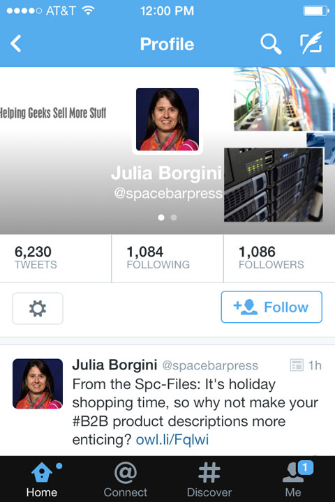

# Gridder
## A CSS-Grid Copy-Kitten Exercise

### Introduction

Remember when [we copied an Instragram profile using Flexbox][instabox]? Those were good times. Let's bring them back by doing the same thing, only with a Twitter profile and CSS Grid. I give you: Gridder.

### The Basics

Using CSS Grid (no Flexbox please!), you'll make a page that emulates the following mobile page:

### Guidelines

* We'll be working on our own for this project. You can do it!
* Just like with [Instabox][instabox], it would be masochism NOT TO screenshot-grab portions of the image.
* In general, if something has text in it, that text should be in the html as content. Otherwise, you can screengrab it as an image. A few things that would just be annoying to add text to, though, you can screengrab the entirety of: the Follow button you can grab as a picture, and the top-left four-dots-AT&T-wifi conglomeration you can screengrab as one image.
* But do _not_ screenshot-grab too much of it. A good amount of screengrab would be to grab each of the four icons at the bottom individually. An unacceptable amount of screengrab would be to grab the words under the icons as well; lining things up is what this assignment is all about.
    An unimaginably bad amount of screengrab would be to grab the entire bottom bar.
    A kick-you-out-of-school amount would be to screenshot the entire profile image and call it a day well spent.
* You do not have to replicate the entire terrible header that Julia Borgini has in this photo (she has a much better one now!). The whole area below the back-Profile-search-new-tweet row and above the follower info row can be screengrabbed.
* Please do NOT use `grid-areas`. We'll get there, but it's important to understand the basic workings of grid first. Don't even _look up_ `grid-areas`. I've already said too much!

[instabox]: https://github.com/abbreviatedman/instabox

